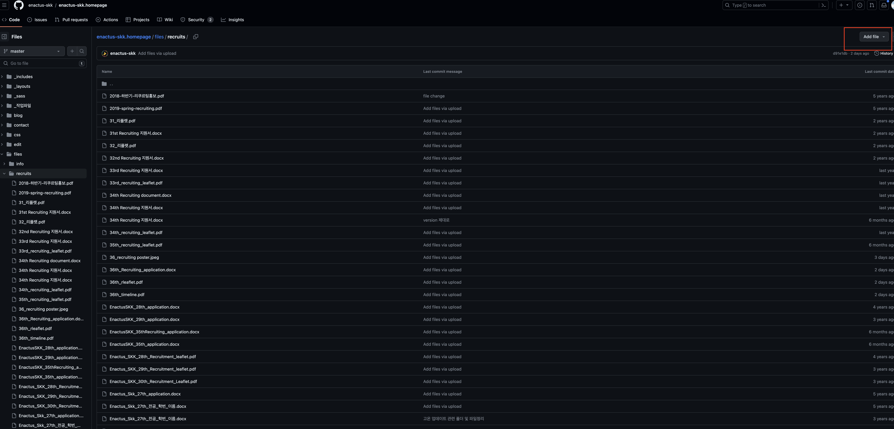
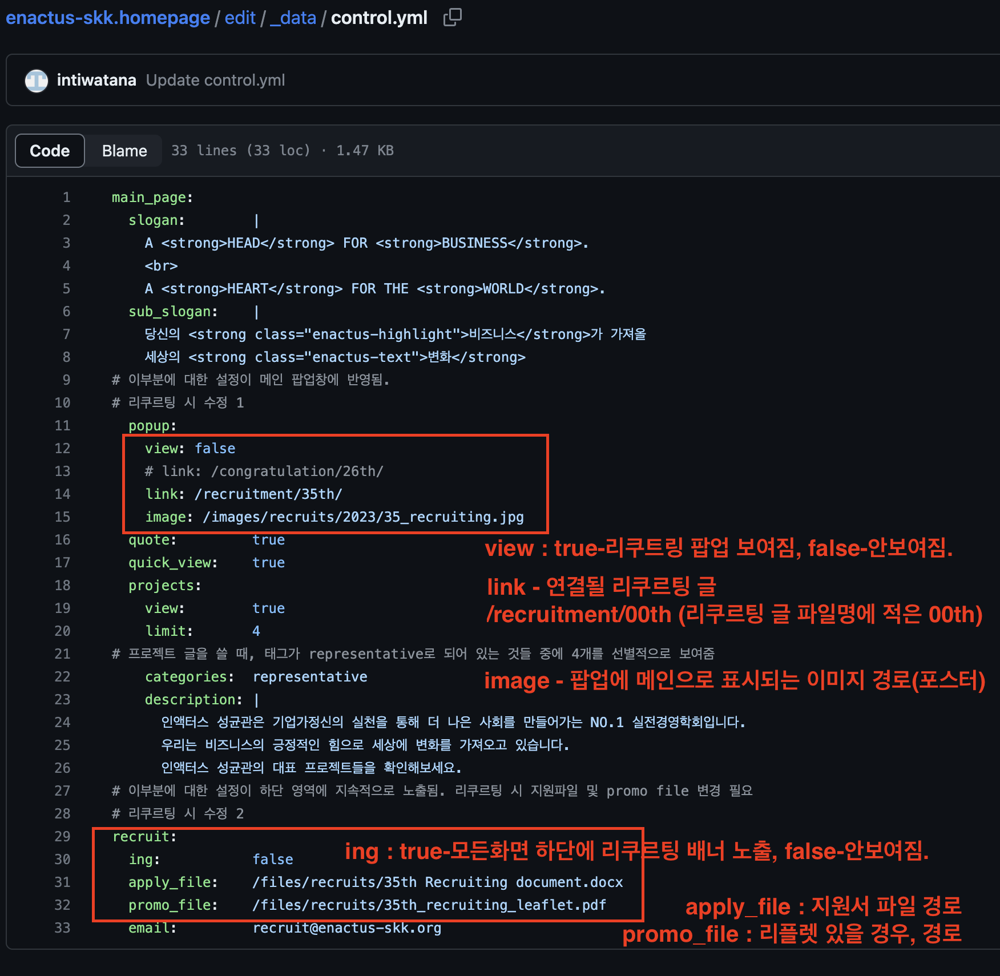

# 인수인계나 가이드는 여기에 작성하면 됩니다.

### Q1. 프로젝트를 새로 등록했는데, 하단에 이미지를 추가하고 싶어요. 어떻게 해야 하나요?

> 예를들어 프로젝트 소개글의 파일이름이 soul인 프로젝트 하단에 이미지를 추가하려면,
> images 폴더 밑에 soul 폴더를 만들고 그 밑에 보여주길 원하는 파일을 넣으면 자동으로 이미지를 보여주게 됩니다.

## 리쿠르팅 설정을 변경하고 혼자서만 확인이 필요할 경우!
- PUBLISHED라고 표시된 버전이 현재 https://enactus-skk.org에 나오는 것
https://app.netlify.com/sites/enactus-skk/deploys

## 리쿠르팅 시 적용순서
1. 리플렛/포스터/지원양식 파일 업로드
https://github.com/enactus-skk/enactus-skk.homepage/tree/master/files/recruits

3. 아래의 경로에서 새 파일을 만든어준다. 우측상단의 Add file(create new ...) [날짜-00th] 형식 (이전 것 참고해서 비슷하게)
https://github.com/enactus-skk/enactus-skk.homepage/tree/master/edit/_posts
4. 만든파일에 내용을 채워넣는다. (이전의 글을 우선 복사해서 붙여넣고 수정하면 편한다.)
5. edit > data > control.yml에 있는 내용을 수정해준다.
https://github.com/enactus-skk/enactus-skk.homepage/blob/master/edit/_data/control.yml

~~[Netlify](https://app.netlify.com/sites/enactus-skk/deploys) 에 가서 publish 해준다.~~
6. 확인. 

## 혼자만 보기 설정을 한 경우에는 반드시 다시 원래대로 해놓는다.
- PUBLISHED라고 표시된 버전이 현재 https://enactus-skk.org에 나오는 것

